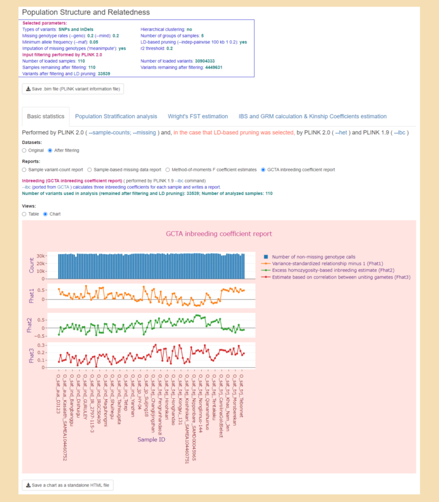
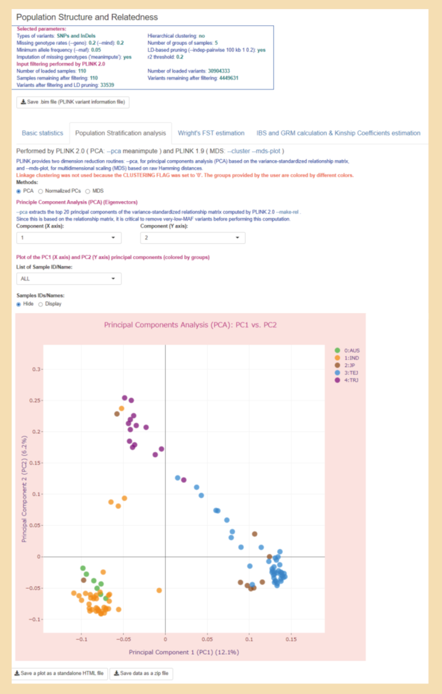
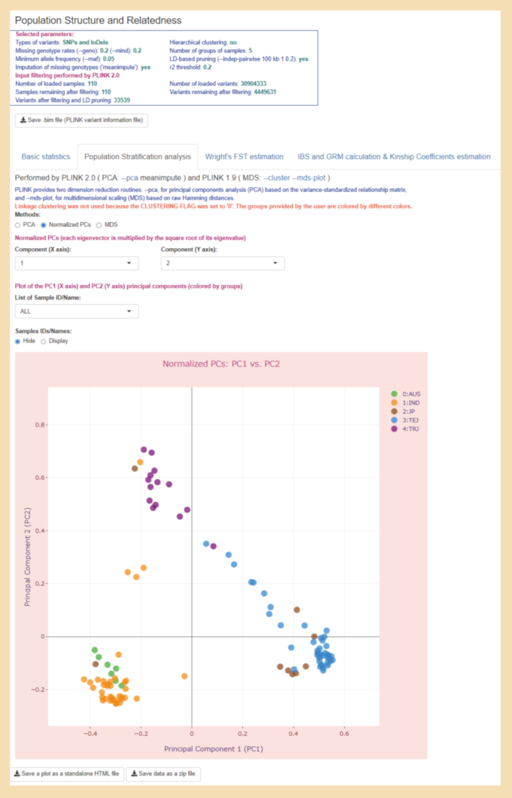
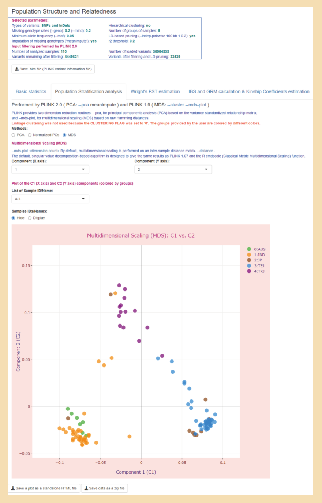
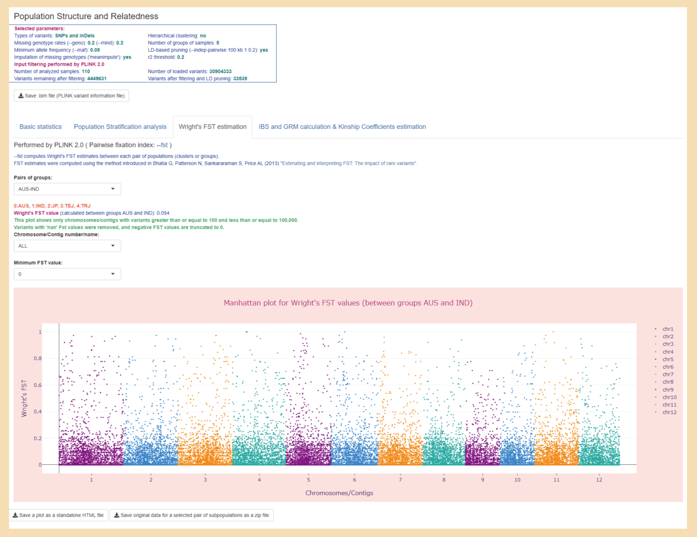
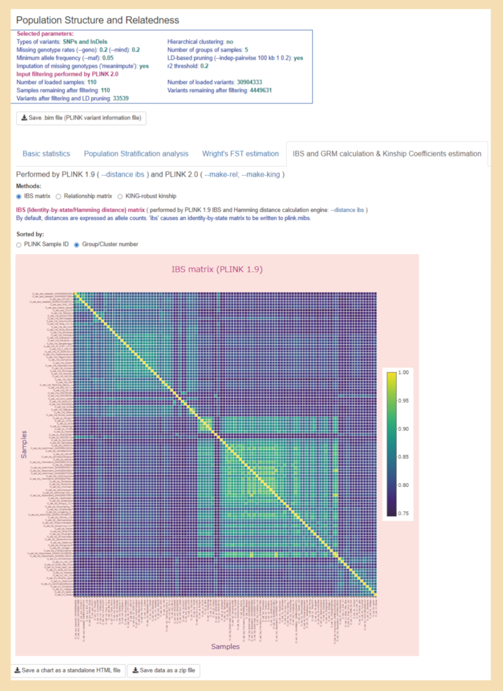
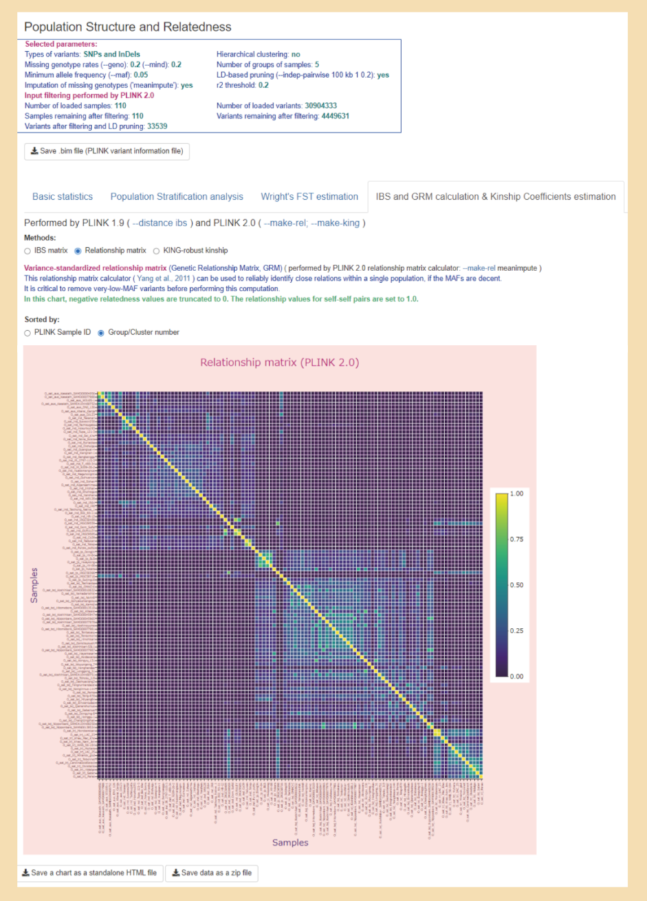

## Case study datasets:
- ### 110 world-wide rice accessions
***Demonstration of how the PSReliP pipeline can be applied to genome-wide genetic variant data of rice varieties.*** 
  The folder [rapdb_30depth_5gr_ld_pr](./rapdb_30depth_5gr_ld_pr) is the folder of the Shiny app, which was created as a result of PSRelIP pipeline execution.
#### Input data
  The genome-wide genetic variant data for 110 world-wide rice accessions from five groups, such as three japonica variety groups (JP: Oryza sativa Japonica Group, TEJ: Oryza sativa temperate japonica subgroup, TRJ: Oryza sativa tropical japonica subgroup) and two indica variety groups (IND: Oryza sativa Indica Group, AUS: Oryza sativa aus subgroup). These samples are registered in the Rice Annotation Project Database ([RAP-DB](https://rapdb.dna.affrc.go.jp)) and have an average depth of sequencing coverage greater than 30. Accession numbers, sample names, and group abbreviations or all of these samples are listed in the file [rice_acces_name_gr.list](./rice_acces_name_gr.list).
#### Used parameter values
  The parameter sets and parameter values used in this pipeline run are listed in [rapdb_30depth_5gr_ld_pr.config](./rapdb_30depth_5gr_ld_pr.config), which is the PSReliP pipeline configuration file.
#### Folder contents
  The Shiny application folder [rapdb_30depth_5gr_ld_pr](./rapdb_30depth_5gr_ld_pr) contains an app.R file and a 'data' subfolder with the analysis results files.
#### Viewing the Shiny app
  Download the Shiny app folder. To run the Shiny app locally, use RStudio to open the app.R file in the Shiny app folder and click on "Run App" in the upper right corner of the source panel. The app will open up in a new window.
#### User interface
  The screenshots of the user interface of this Shiny app can be found in the [Images](../Images/case_study_UI_screenshots) folder. 
  The Shiny app created by our pipeline contains four tabs corresponding to the types of analysis performed in it. These tabs are as follows: 1) ‘Basic statistics’; 2) ‘Population Stratification analysis’; 3) ‘Wright's FST estimation’; 4) ‘IBS and GRM calculation & Kinship Coefficients estimation’. 
* On the opening page, the first tab "Basic statistics" displays the 'Sample variant-count report' in a tabular format.  

* By selecting "Chart" in the radio button labeled "Views", users can display this report as a stacked bar chart. 

* Also on this tab, users can display other reports, such as the 'Sample-based missing data report', 'Method-of-moments F coefficient estimates', and 'GCTA inbreeding coefficient report', by selecting the corresponding values from the radio button labeled 'Reports'.  

* On the 'Population Stratification analysis' tab, users can display population stratification analysis results such as 'PCA', 'Normalized PCs', and 'MDS' Chart representations by selecting the corresponding values from the radio button labeled 'Methods'.

* The 'Wright's FST estimation' tab allows users to display Manhattan plots for the results of Wright's fixation index (FST) analysis for each variant between pairs of selected subpopulations. These plots display genetic variants with per-variant FST values against their genomic position. We plot chromosomes/contigs one at a time or the entire genome region only if the number of variants they contain is greater than or equal to 100 and less than or equal to 100,000. Users can switch these views by changing the corresponding value in the "Chromosome/Contig number/name:" drop-down list. In our pipeline, we run the PLINK --fst command with the 'report-variants' modifier, which calculates FST estimates for each variation, and then output these results to Manhattan plots only if the number of groups/clusters is less than or equal to 5 (to control output size).

* On the 'IBS and GRM calculation & Kinship Coefficients estimation' tab, users can display heatmaps of IBS distances, genetic relationships, and KING-robust kinship coefficients across all individuals (samples) by selecting the corresponding values from the radio button labeled 'Methods'. The 'Group/Cluster number' radio button allows users to select the sort order of the samples for the heatmap, which can be the same as in the matrix obtained by the corresponding PLINK command (‘PLINK Sample ID’), or can be remade according to the groups/clusters to which the samples are assigned.

