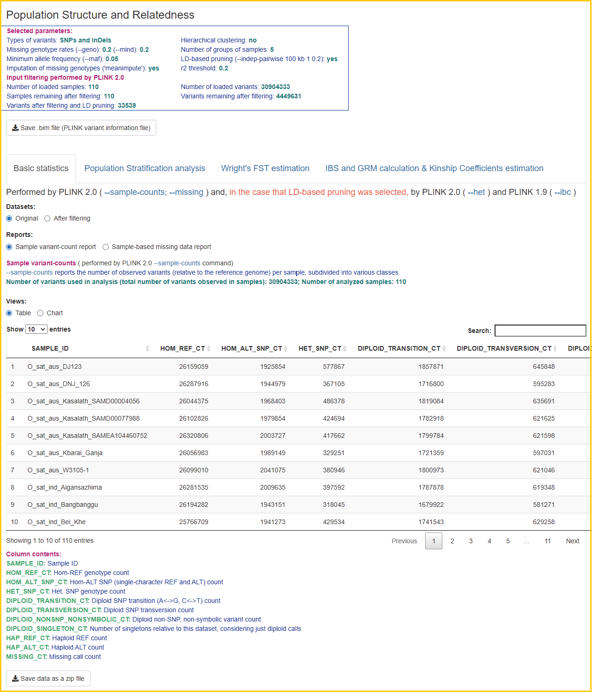
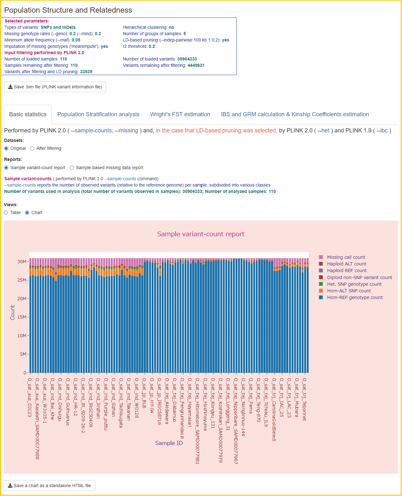
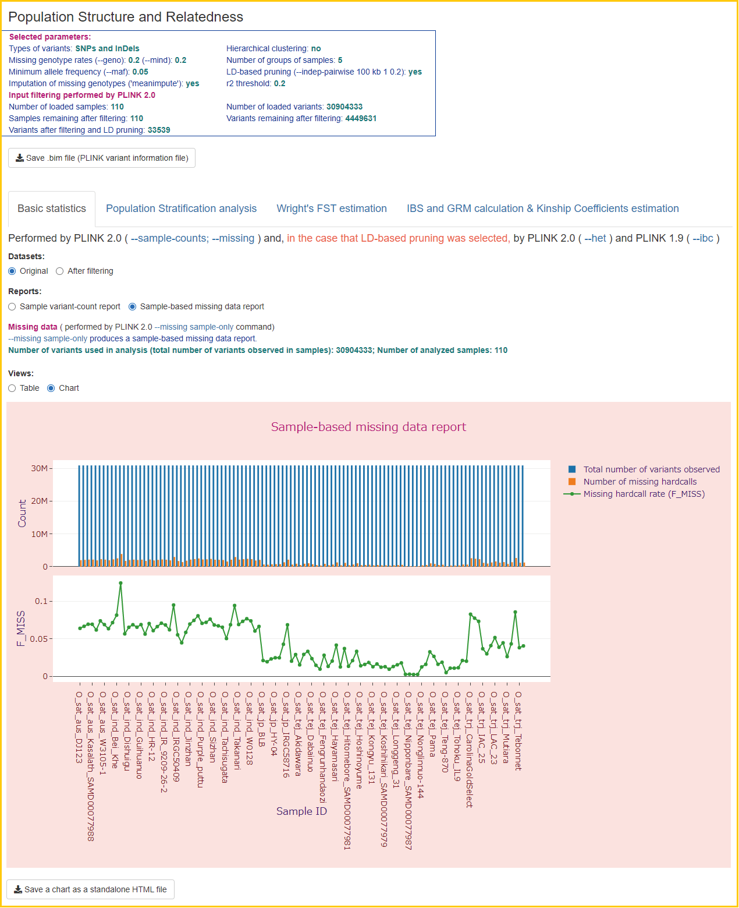
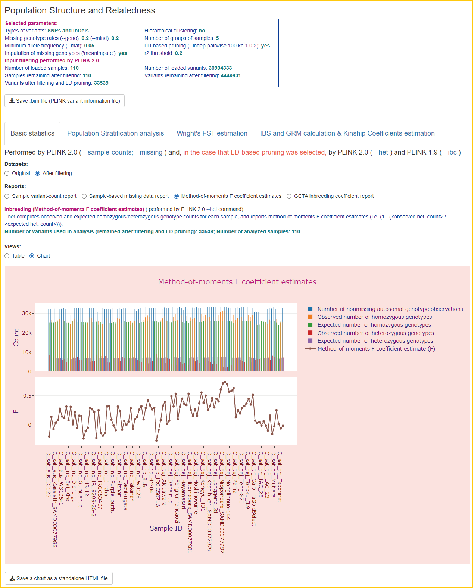

## Case study dataset:
- ### 110 worldwide rice samples registered in the Rice Annotation Project Database (RAP-DB)
***Demonstration of how the PSReliP pipeline can be applied to genome-wide genetic variant data of rice varieties.*** 
  The folder [rapdb_30depth_5gr_ld_pr](./rapdb_30depth_5gr_ld_pr) is the folder of the Shiny app that was created by running the PSRelIP pipeline.
#### Input data
  This study used data on genetic variants of 110 accessions of rice varieties from five groups, such as three japonica variety groups (JP: Oryza sativa Japonica Group, TEJ: Oryza sativa temperate japonica subgroup, TRJ: Oryza sativa tropical japonica subgroup) and two indica variety groups (IND: Oryza sativa Indica Group, AUS: Oryza sativa aus subgroup). These samples are registered in the Rice Annotation Project Database ([RAP-DB](https://rapdb.dna.affrc.go.jp)) and have an average depth of sequencing coverage greater than 30. The accession numbers, sample names and group abbreviations of all these samples are listed in the file [rice_acces_name_gr.list](./rice_acces_name_gr.list).
#### Used parameter values
   The parameter values used in the PS analysis are listed in in [rapdb_30depth_5gr_ld_pr.config](./rapdb_30depth_5gr_ld_pr.config), which is the PSReliP pipeline configuration file.
#### Folder contents
  The Shiny application folder [rapdb_30depth_5gr_ld_pr](./rapdb_30depth_5gr_ld_pr) contains an app.R file and a 'data' subfolder with analysis results files.
#### Running the Shiny app
  Download the Shiny app folder. To run the Shiny app locally, use RStudio to open the app.R file in the Shiny app folder and click on "Run App" in the upper right corner of the source panel. The app will open in a new window. In addition, the Shiny application can be run on Shiny servers such as shinyapps.io, RStudio Connect, Shiny Server Open Source, Shiny Server Pro.
#### User interface
  The screenshots of the user interface of this Shiny app can be found in the [Images](../Images/case_study_UI_screenshots) folder. 
  The Shiny app created by our pipeline contains four tabs corresponding to the types of analysis performed in it. These tabs are as follows: 1) ‘Basic statistics’; 2) ‘Population Stratification analysis’; 3) ‘Wright's FST estimation’; 4) ‘IBS and GRM calculation & Kinship Coefficients estimation’. 
* On the opening page, the first tab "Basic statistics" displays the 'Sample variant-count report' in tabular format.  

* By selecting "Chart" from the radio button labeled "Views", users can display this report as a stacked bar chart. 

* Also on this tab, users can display other reports, such as the 'Sample-based missing data report', 'Method-of-moments F coefficient estimates', and 'GCTA inbreeding coefficient report', by selecting the corresponding values from the radio button labeled 'Reports'.  

* On the 'Population Stratification analysis' tab, users can display the results of population stratification analysis in the form of 'PCA', 'Normalized PCs' and 'MDS' charts by selecting the corresponding values from the radio button labeled 'Methods'.

* The 'Wright's FST estimation' tab allows users to display Manhattan plots for the results of Wright's fixation index (FST) analysis for each variant between pairs of selected subpopulations. These plots display genetic variants with per-variant FST values against their genomic position. In our pipeline, we run the PLINK --fst command with the 'report-variants' modifier, which calculates the per-variant FST estimates, and then output these results to Manhattan plots only if the number of groups/clusters is ≤5 (to control the output size). We plot chromosomes/contigs one at a time or the entire genome region only if the number of variants is ≥100 and ≤ 100,000. Users can switch these views by changing the corresponding values from the "Chromosome/Contig number/name:" drop-down list.

* On the 'IBS and GRM calculation & Kinship Coefficients estimation' tab, users can display the results of the three types of calculations by selecting the corresponding values from the radio button labeled 'Methods'. We prepared three methods: IBS matrix calculation, GRM, and KING-robust kinship estimation. The results are displayed on interactive heatmaps, where samples can be ordered in two ways, ‘PLINK Sample ID’ and ‘Group/Cluster number’. The list of sample IDs/Names on the heatmap can be in the same order as in the matrix derived from the corresponding PLINK command, or samples can be reordered according to the groups/clusters to which they are assigned.

