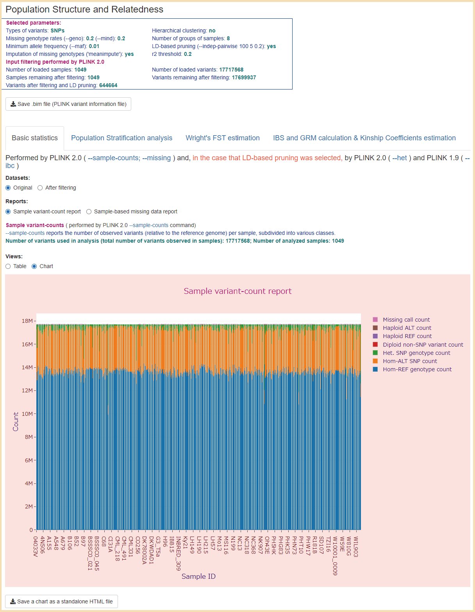
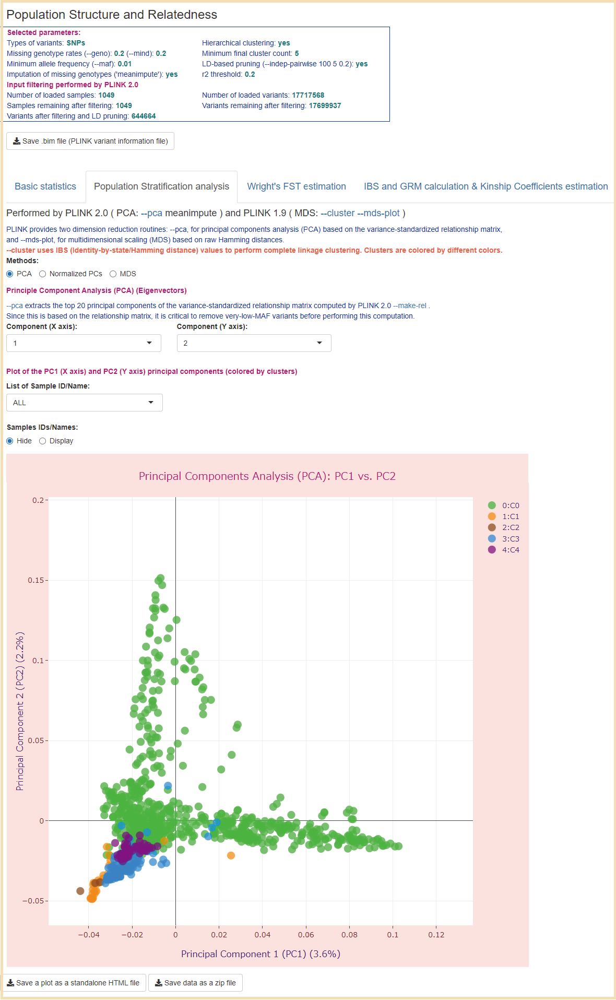
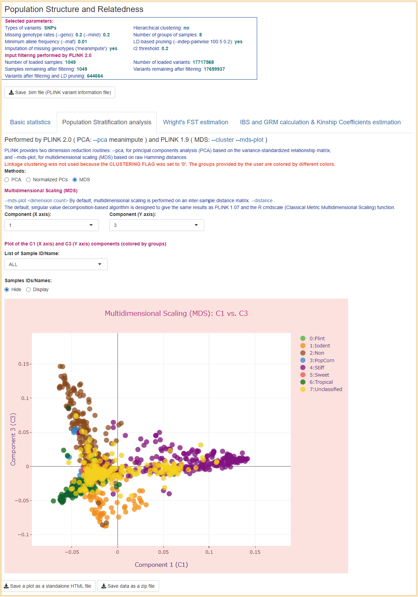

## Examples of the use of datasets with large sample size
### ***Data on genome-wide genetic variants of maize varieties*** 
### These Shiny applications use data from the following articles:
1. Mural RV, Sun G, Grzybowski M, Tross MC, Jin H, Smith C, et al. Association mapping across a multitude of traits collected in diverse environments in maize. Gigascience 2022;11:giac080. [doi: 10.1093/gigascience/giac080](https://doi.org/10.1093/gigascience/giac080)
2. Lin M, Matschi S, Vasquez SM, Chamness J, Kaczmar N, Baseggio M et al. Genome-Wide Association Study for Maize Leaf Cuticular Conductance Identifies Candidate Genes Involved in the Regulation of Cuticle Development, G3 Genes|Genomes|Genetics 2020;10(5):1671-1683. [doi: 10.1534/g3.119.400884](https://doi.org/10.1534/g3.119.400884)
3. Mural R, Sun G, Grzybowski M, Tross MC, Jin H, Smith C, et al. (2022): Maize_WiDiv_SAM_1051Genotype.vcf.gz genotype file. figshare. Dataset. https://doi.org/10.6084/m9.figshare.19175888.v1 **(Maize_WiDiv_SAM_1051Genotype.vcf.gz] genotype file)**
### Origins of the data
  From the VCF file above [Ref. 3] we extracted two datasets consisting of 1049 and 380 samples and analysed them with our pipeline. The dataset 1049 contains all samples in SupplementalDataFileS2_GenotypesAndTraitValues.xlsx (Supplemental Data for Ref. 1). The dataset of 380 samples contains samples for which the values of the column "LeafCuticularConductance6_H" in the same Excel file do not equal "NA". This column contains the 'maize leaf cuticular conductance' phenotype values that were collected in the study by Lin et al. 2020 [Ref. 2] in 2017 in Maricopa, Arizona. The resulting applications for these datasets are presented in this sub-repository. 
### Running Shiny apps
- Required R packages: 
R (3.6+), shiny (1.4.0.2+), plotly (4.9.2.1+), manhattanly (0.2.0+), heatmaply (1.1.0+), ggplot2 (3.3.0+), DT (0.16+), stringr (1.4.0)
- Running these Shiny apps from the GitHub repository: 

**If all required R packages are installed in your R environment, run the following lines in interactive R sessions to launch these Shiny apps from the GitHub repository. The application files will be stored in a temporary directory and removed when the apps exits.** 

 > `> library(shiny)` 
 > `> runGitHub("PSReliP", "solelena", subdir = "Examples_large_datasets/maize_1049samp_cl5_ld")` 
 > `> runGitHub("PSReliP", "solelena", subdir = "Examples_large_datasets/maize_1049samp_gr_ld")` 
 > `> runGitHub("PSReliP", "solelena", subdir = "Examples_large_datasets/maize_380samp_gr_ld")` 

### User interfaces
  The screenshots of the user interface of these Shiny apps can be found in the [Images](../Images/Examples_large_datasets) folder. 
  The Shiny apps created by our pipeline contains four tabs corresponding to the types of analysis performed in it. These tabs are as follows: 1) ‘Basic statistics’; 2) ‘Population Stratification analysis’; 3) ‘Wright's FST estimation’; 4) ‘IBS and GRM calculation & Kinship Coefficients estimation’. 
* **'Basic statistics' tab 'Sample variant-count report'** 
***From the [maize_1049samp_gr_ld](./maize_1049samp_gr_ld) application*** 

* **'Basic statistics' tab 'Method-of-moments F coefficient estimates'** 
***From the [maize_1049samp_gr_ld](./maize_1049samp_gr_ld) application*** 

* **'Population Stratification analysis' tab 'Principal Components Analysis (PCA)'** 
***From the [maize_1049samp_cl5_ld](./maize_1049samp_cl5_ld) application*** 

* **'Population Stratification analysis' tab 'Multidimensional Scaling (MDS)' C1-C2** 
***From the [maize_1049samp_gr_ld](./maize_1049samp_gr_ld) application*** 

* **'Population Stratification analysis' tab 'Multidimensional Scaling (MDS)' C1-C3** 
***From the [maize_1049samp_gr_ld](./maize_1049samp_gr_ld) application*** 

* **'Wright's FST estimation' tab Pairs of clusters: C0-C1** 
***From the [maize_1049samp_cl5_ld](./maize_1049samp_cl5_ld) application*** 

* **'IBS and GRM calculation & Kinship Coefficients estimation' tab 'IBS (Identity-by-state/Hamming distance) matrix'** 
***From the [maize_380samp_gr_ld](./maize_380samp_gr_ld) application*** 

* **'IBS and GRM calculation & Kinship Coefficients estimation' tab 'IBS (Identity-by-state/Hamming distance) matrix' (zoomed in)** 
***From the [maize_380samp_gr_ld](./maize_380samp_gr_ld) application*** 

* **'IBS and GRM calculation & Kinship Coefficients estimation' tab 'Genomic Relationship Matrix (GRM)' (zoomed in)** 
***From the [maize_380samp_gr_ld](./maize_380samp_gr_ld) application*** 

