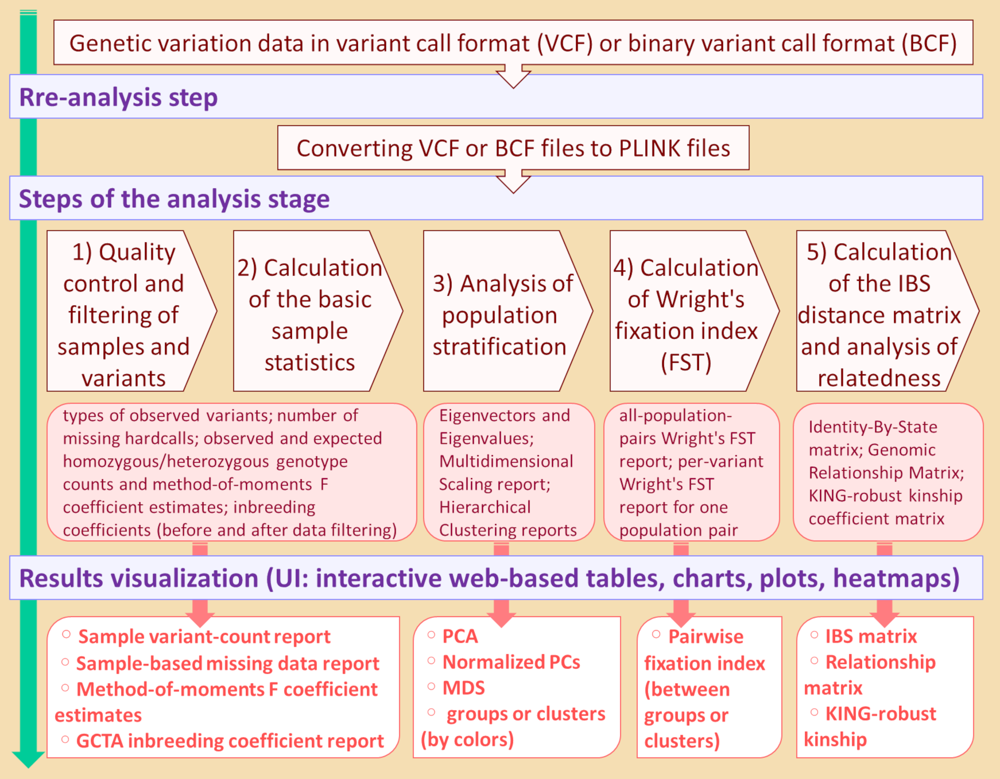

## Population Structure and Relatedness integrated Pipeline (PSReliP)
***PSReliP: an integrated pipeline for analysis and visualization of population structure and relatedness based on genome-wide genetic variant data***  
  The PSReliP pipeline allows users to quickly analyze genetic variants such as single nucleotide polymorphisms and small insertions or deletions at the genome level to estimate population structure and cryptic relatedness using PLINK software and to visualize the analysis results in interactive tables, plots, and charts using Shiny technology. The analysis and assessment of population stratification and genetic relatedness can aid in choosing an appropriate approach for the statistical analysis of GWAS data and predictions in genomic selection. The various outputs from PLINK can be used for further downstream analysis. 
## Features
- QC and  and filtering of samples and variants;
- calculation of basic sample statistics, such as the types of observed variants, inbreeding coefficients, etc., and performing the before and after data filtering;
- analysis of PS using PCA and MDS, and complete-linkage hierarchical clustering of samples based on the IBS distance matrix, if selected;
- calculation of Wright's FST;
- calculation of the IBS distance matrix and analysis of genetic relatedness by estimating the KING kinship coefficient matrix and GRM;
- interactive visualization of the analysis results using Shiny technology;
- ability for users to download analysis results and all plotted graphs using the web interface.
### ***The structure and main features of the PSReliP pipeline***

## Implementation
- **Analysis stage**  
  The analysis stage, which includes the pre-analysis step, is performed by two bash shell scripts that contained PLINK command lines, bash, and Unix commands and invoked in-house [Perl programs](./psrelip_pipeline/program_files/perl_programs). These bash shell scripts are executed from the command line on the UNIX or LINUX operating systems and take several arguments from the [configuration file](./psrelip_pipeline/psrelip.config). The configuration file is located in the PSReliP installation directory and contains information about the paths to the PLINK executables (1.9 and 2.0), pipeline installation directory, working directory, input files, and parameter values used in the analysis and visualization processes. Users must edit the configuration file before executing the bash shell scripts. The details of the setting parameters are described in the configuration file. 
  PLINK (1.9 and 2.0) is the main software used in all the analysis steps in PSReliP. We used PLINK 2.0 in all cases; however, there are certain commands, such as --ibc, --cluster, --mds-plot, and --distance, that have not yet been implemented in PLINK 2.0; in such a case, we used version 1.9 of the PLINK software. 
  In the pre-analysis step of PSReliP, the VCF or BCF files areconverted into PLINK format files. This step is performed by running the [first shell script](./psrelip_pipeline/pre_analysis_first_script.sh) that takes VCF (possibly gzipped) and BCF files as inputs, which can be either uncompressed or BGZF-compressed (supported by htslib). The main outputs of this step are PLINK 2 binary files in the following formats: PGEN, binary genotype file format; PSAM, format in which sample information is stored; and PVAR, format in which variant information is stored. The newly created PLINK 2 binary files are used as inputs for the following analysis steps. Only one filter, such as ‘--max-alleles 2’, is applied in this pre-analysis processing step. It is sufficient to run the first shell script only once for a given set of genetic variants for one specified working directory to prepare the input files for the following analysis. When changing the working directory, it is necessary to start the analysis stage from the beginning and run the first shell script again. 
  The analysis stage itself is performed by running the [second shell script](./psrelip_pipeline/analysis_second_script.sh), which executes all steps of the analysis carried out by this pipeline. During the analysis stage, the following processes are performed:
 - quality control and filtering of samples and variants
 - calculation of basic sample statistics
 - analysis of population stratification using PCA, MDS and clustering
 - calculation of Wright's FST
 - calculation of IBS matrix, GRM and KING kinship coefficient matrix 
  All these analysis processes are carried out by PLINK 1.9 and 2.0 software. 
  While running this second shell script, the PLINK, bash, and Unix commands are executed sequentially, and many of these commands take input from the previous command and produce output for the next one. Many of the parameters used in the analysis steps can be varied by the user by appropriately changing their values in the [configuration file](./psrelip_pipeline/psrelip.config) before running the shell script. Users can run the second shell script multiple times on the given genetic variant dataset and, using different parameter values, perform the analysis that best matches their data.
- **Visualization component**  
  To visualize the results of the analysis, we created a web visualization component for PSRelIP by developing the Shiny app, an interactive R-based web application using [R Shiny technology](https://github.com/rstudio/shiny). 
  We use the Shiny package in combination with the [Plotly's R graphing library](https://github.com/plotly/plotly.R), which allows the creation of interactive graphs and provides basic interactivity such as zooming in and out, panning graphs, point value display, and much more. Using the Plotly R library for basic charts, we created grouped and stacked bar charts and line plots and a combination of these for basic sample statistics, including GCTA inbreeding coefficient report, and scatter plot for the PS analysis results (PCA plot). In the scatter plot for PCA (bubble chart), marker sizes are variable and marker colors are mapped to a categorical variable. 
  Using Plotly in conjunction with the [‘manhattanly’ R package](https://github.com/sahirbhatnagar/manhattanly/), we created Manhattan plots for the Wright's fixation index (FST) analysis results. In these plots, the genetic variants are plotted with per-variant FST values against their genomic position. Manhattan plots implemented with the ‘manhattanly’ package have the advantage of including extra annotation information to each point of these plots. 
  Using Plotly in conjunction with the [‘heatmaply’ R package](https://github.com/talgalili/heatmaply/), we created heatmaps of IBS distances, genetic relationships, and kinship coefficients across all individuals (samples). Interactive heatmaps have the capability of zooming into a region of interest and allow the checking of values by hovering the mouse over a cell. 
  To visualize the basic statistics of the samples, along with the charts, we also created tables with the [‘DT’ (DataTables) R package](https://github.com/rstudio/DT/), which allows users to display their data as tables in the HTML pages and provides filtering, sorting, searching, and other features in the tables.
### ***Implementation of the PSReliP pipeline***

## Installation
* Install PLINK (1.9 and 2.0) in UNIX/Linux based OS.
* Create a directory in your home directory you would like to install the PSReliP pipeline.
* Copy the files and the 'program_files' folder contained in the [PSReliP pipeline](./psrelip_pipeline) folder, which includes the two shell scripts, the configuration file, Perl programs and Shiny app.R files to the directory you created. This directory is the installation directory of the pipeline and must be specified in the "TOOL_INSTALL_DIR" parameter in the [configuration file](./psrelip_pipeline/psrelip.config). It is important to leave the names and structure of the 'program_files' folder in this directory. The two shell scripts and the configuration file can be renamed and placed in any directory. The path to the configuration file must be specified in both shell scripts.
* Edit the [configuration file](./psrelip_pipeline/psrelip.config) and specify the path to the PLINK executables (1.9 and 2.0), the pipeline installation directory explained above, the working directory, the input files and the parameter values used in the analysis and visualization processes.
* Install the necessary R packages in a UNIX/Linux-based OS if you want to run the Shiny app on a [Shiny Server](https://github.com/rstudio/shiny-server), or in RStudio if you want to run the Shiny app in a desktop version of [RStudio](https://www.rstudio.com/products/rstudio/).
## Version Requirements
- PLINK 1.9: 19 Oct 2020 or later.
- PLINK 2.0: Development (8 Jun 2021) or later.
- R and R packages: R (3.6+), shiny (1.4.0.2+), plotly (4.9.2.1+), manhattanly (0.2.0+), heatmaply (1.1.0+), ggplot2 (3.3.0+), DT (0.16+), stringr (1.4.0).
## Getting Started
* In the configuration file, in the "VCF_FILE_NAME" parameter, specify the path to the input genotype file in the formats '.vcf/.vcf.gz/.bcf/.bcf.gz'.
* In the configuration file, in the "WD" parameter, specify the path to the working directory where all the output files of the analysis will be saved (there can be one working directory for each file in Variant Call Format).
* To convert VCF/BCF file to PLINK format, specify the path to the edited configuration file in the first shell script ([pre_analysis_first_script.sh](./psrelip_pipeline/pre_analysis_first_script.sh)) and run this shell script. PLINK 2 binary fileset will be created and saved in the 'bed_files' subdirectory in the working directory. This shell script uses only one filter, such as '--max-alleles 2' (excludes variants with more than 2 alleles). In addition, this script runs the PLINK command line to generate an allele count report, which is a valid input for the --read-freq flag that will be used in further analysis. This allele count report will be saved in the same 'bed_files' subdirectory.
* To perform the analysis stage, specify the path to the edited configuration file in the second shell script ([analysis_second_script.sh](./psrelip_pipeline/analysis_second_script.sh)) that executes all the analysis steps carried out by this pipeline, and run that shell script. The analysis stage is responsible for performing all the data filtering and analysis steps and contains an ordered sequence of PLINK commands along with in-house shell scripts and PERL programs that support data pipelining. You can run the second shell script several times on a given genetic variant dataset and, using different parameter values, perform the analysis that best matches your data. The PSReliP implementation, especially the PLINK command lines with flags and parameters, is described in detail in the README.md file in the [psrelip_pipeline](./psrelip_pipeline) folder.
* At the end of the PSRelIP analysis stage, the second shell script creates a subdirectory in the directory specified in the "SHINY_APP_DIR" parameter of the configuration file with the name specified in the "OUTPUT_PREFIX" parameter, and copies the Shiny app (app.R) we developed into that directory. The results of the analysis as well as the file containing the arguments for the Shiny app are also copied into this directory, namely into its 'data' subdirectory.
### ***Structure of directories and files created in the PSRelIP pipeline***

**Note** that some temporarily created files are deleted during the execution of both shell scripts to reduce disk space usage. 
* To run the newly created Shiny app locally, use RStudio to open the app.R file in the Shiny app folder and click on "Run App" in the upper right corner of the source panel. The Shiny app can also be deployed to [ShinyApps.io](https://www.shinyapps.io/) or hosted on the [Shiny Server](https://www.rstudio.com/products/shiny/shiny-server/). 
* We created the Shiny app for the Case Study dataset, which we placed in the [Case_study_datasets](./Case_study_datasets) folder to illustrate the capabilities of our pipeline and the features of its user interface. Details of this case study can be found in the [README.md](./Case_study_datasets/README.md) file located in that folder. The screenshots of the user interface of this Shiny app can be found in the [Images](./Images/case_study_UI_screenshots) folder.

